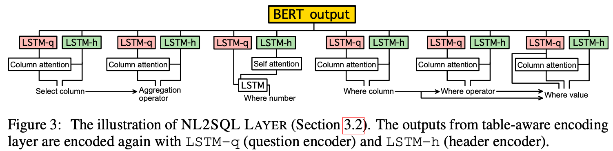
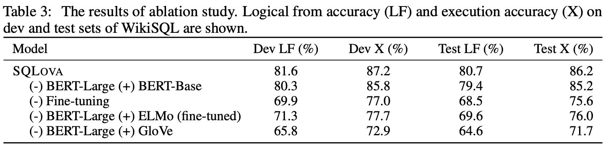

# A Comprehensive Exploration on WikiSQL with Table-Aware Word Contexturalization

> Created: May 11, 2021 12:01 PM  
> By Woo Chul Lee

# References: 
- [A Comprehensive Exploration on WikiSQL with Table-Aware Word Contextualization](https://arxiv.org/abs/1902.01069)
- [naver/sqlova](https://github.com/naver/sqlova)

# Abstract 
본 페이퍼에서 첫번째 NL2SQL(Natural Language to SQL) 모델로서, WikiSQL 데이터셋에 관해 인류의 퍼포먼스에 준하도록 구현이된 **SQLova**를 소개한다. 효과적인 컨텍스트를 만들고 이를 조합하기 위해 **BERT**(Devlin et al., 2018)의 특성을 적극 활용한다. 

# Model 
**SQLova**는 크게 2가지 레이어로 구성이 되어있다.
- Encoding Layer: Table-aware Contextualization를 위한 인코더
- NL2SQL Layer: (앞에서 축약된 Contextualized word Representation을 바탕으로)SQL Query를 생성하는 레이어
  
&nbsp; 이전에 work에서는 흔히 BERT에 seq2seq2 모델을 단순히 얹기만 했었는데, 성능이 상당히 좋지 않았던 바, 이는 BERT를 활용할 때 Structured Data를 시의적절하게 유의해서 사용해야하는 교훈을 일깨워준다. 이에 본 페이퍼에서는 상당히 조심스레 디자인된 아키텍서를 제안한다. 이에 따라 Large Pre-trained Model과 NL2SQL을 조합한 훌륭한 결과를 낼 것이다.

## Table-aware Encoding Layer
- 인코더: {Query + Table} $\rArr$ {Contextualized Word Representation}   
  
기존 **BERT**(Devlin et al., 2018)에 전체 테이블의 헤더를 얹은 확장형 쿼리를 만들 것이다. 이 과정에서 BERT의 스페셜 토큰인  `[SEP]`을 활용한다. 이는 쿼리와 헤더를 구분하는 데에 쓰인다. 
  
$$[CLS], T_{n,1}, \dots, T_{n,L}, [SEP], T_{h_1, 1}, T_{h_1, 2}, \dots, [SEP], \dots,T_{h_{N_h}, 1}, \dots, T_{hN_h, M_{N_h}}, [SEP]$$
  

- $T_{n, L}$: 쿼리 인풋을 나타내는 부분이며, $L$은 쿼리 단어의 갯수
- $T_{h_j, k}$: $h_j$($j$번째 테이블 헤더)의 $k$번째 토큰
- Segment Id 
  - 0: Questions Tokens
  - 1: Header Tokens

## NL2SQL Layer
- 디코더: {Contextualized Word Representation} $\rArr$ {SQL Query}     
  
**Table-aware Encoding Layer**위에다 쌓는 레이어다. 전형적인 시퀀스 생성 모델이다. 결코 단순한 Syntax에만 의존하지 않는다. 6개 모듈들에 따라 Syntax-guided Sketch를 형성할 예정이다. `SELECT-COLUMN`, `SELECT-AGGREGATION`, `WHERE-NUMBER`, `WHERE-COLUMN`, `WHERE-OPERATOR`, `WHERE-VALUE`. Table-aware encoding 의 아웃풋은 또다시 Bi-directional LSTM 100개의 레이어를 지난다. 이는 Contexualization을 위함이다. `LSTM-q`는 질문 인코더, `LSTM-h`는 표 헤더 인코더다.

- 서브 모듈
  - `SELECT-COLUMN`
    - Column-attention 메커니즘(Xu et al., 2017)을 이용하였으며 주어진 자연어에서 어떤 열을 선택할지 찾는다. 

      $$s(n|c) = D_c^{T} \mathcal{W}E_n$$
      $$p(n|c) = \text{softmax}(s(n|c)) \tag{probability of generating column c}$$
      $$C_c = \sum_n p(n|c)E_n \tag{context vector of question for given column}$$
      $$s_{sc}(c)= \mathcal{W}\text{tanh}([\mathcal{W}D_c;\mathcal{W}C_c])$$
      $$p_{sc}(c) = \text{softmax}(s_{sc}(c)) \tag{probability of generating column c}$$
      
      - $D_c$: 헤더 c의 인코딩 값
      - $E_n$: n번째 토큰의 LSTM 아웃풋
      - $\mathcal{W}$: Affine Transformation
      - $[?;?]$: Concatenation

  - `SELECT-AGGREGATION`
    - 주어진 `c`에 따라 오퍼레이터 `agg`를 찾는 작업이다. `agg`는 (`NONE, MAX, MIN, COUNT, SUM, AVG`)중 하나이다. 그 확률값은 아래와 같이 구한다.

      $$p_{sa}(\text{agg}|c) = \text{softmax}(\mathcal{W}\text{tanh}\mathcal{W}C_c)$$
      
      - $C_c$: `SELECT-COLUMN`에서와 마찬가지의 방법으로 구한 Context Vector

  - `WHERE-NUMBER`
    - Contextualizing Column $C$에 따른 `WHERE` 조건의 갯수를 찾는다. self-attention과  $C$에 따른 Contextualizing question $C_q$를 활용한다.
    - 이 서브모듈은 SQLNet(Xu et al., 2017)과 동일하다 
  
      $$p(c) = \text{softmax}(\mathcal{W}D_c)$$
      $$C = \sum_c p(c) D_c$$
      $$h = \mathcal{W}C \tag{hidden input to LSTM encoder}$$
      $$c = \mathcal{W}C \tag{cell input to LSTM encoder}$$
      $$p'(n) = \text{softmax}(\mathcal{W}\text{bi-LSTM}(E_n,h,c))$$
      $$C_Q = \sum_n p'(n)E_n$$
      $$s_{wn} = \mathcal{W}\text{tanh}\mathcal{W}C_Q$$

  - `WHERE-COLUMN`
    - column-attention을 통해 column $c(p_{wc}c)$를 관찰할 확률을 구한다.
      $$s_{wc}(c) = \mathcal{W}\text{tanh}([\mathcal{W}D_c;\mathcal{W}C_c])$$
      $$p_{wc}(c) = \text{sigmoid}(s_{wc}(c))$$
      - $C_c$: `SELECT-COLUMN`에서와 마찬가지의 방법으로 구한 Context Vector

  - `WHERE-OPERATOR`
    - column-attention을 통해 $c$ 컬럼의 `WHERE`의 오퍼레이터 $\text{op} \isin \{=, >, < \}$를 찾는다.
      $$s_{wo}(\text{op}|c) = \mathcal{W}\text{tanh}\mathcal{W}([\mathcal{W}D_c;\mathcal{W}C_c])$$
      $$p_{wo}(\text{op}|c) = \text{softmax}s_{wo}(\text{op}|c)$$

      - $C_c$: `SELECT-COLUMN`에서와 마찬가지의 방법으로 구한 Context Vector
  
  - `WHERE-VALUE`
    - $c$, $\text{op}$에 따른 start와 end token의 위치를 찾아낸다. 
      $$\text{vec} = [E_n;\mathcal{W}C_c;\mathcal{W}D_c;\mathcal{W}V_{op}]$$
      $$s_{wv}(n|c,\text{op}) = \mathcal{W}\text{tanh}\mathcal{W}\text{vec}$$

      - $V_{\text{op}}$: one-hot vector of $\text{op} \isin \{=, >, < \}$
      - $[?;?]$: Concatenation
      - 1st element of $s_{wv}$: start-index
      - 2nd element of $s_{wv}$: end-index

# Contribution
- NL2SQL 레이어가 SQLNet(Xu et al., 2017)로부터 착안된 것이긴 하나 가장 차별적인 장점은 NL2SQL 레이어는 변수를 공유하지 않는 점이다. 또한 `WHERE` 컨디션을 찾기 위한 포인터 네트워크를 구축하기 보다는 (Dong and Lapata, 2018)과 같이 start-index, end-index를 찾아내기 위한 방법론을 적용하였다. 

# Execution-Guided Decoding(EG)
- SQL쿼리를 생성하는 디코딩 과정에서, 쿼리 자체가 테이블로 비추어보아 아예 말이 되지 않는 경우가 있다. 이에 따라 우리는 (Wang et al., 2018a; Yin and Neubig, 2018)에 따라서 디코딩 후보군 중에서 말이 되지 않는 Query는 빼도록 작용을 주었다. 가령 string type 데이터만 존재하는 column에 aggregation operator는 수행할 수가 없다. 이러한 경우는 후보군에서 제거하는 것이 맞다. 실험결과 이 방법을 쓰는 것이 모델 성능 향상에 어느정도 기여함을 알 수 있다.

# Experiments

# Ablation Study

감사합니다.